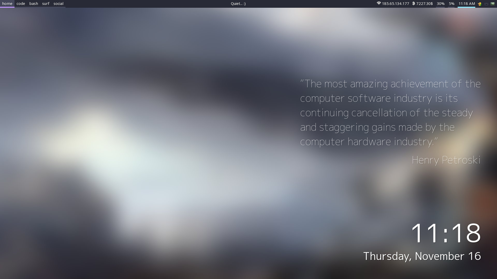
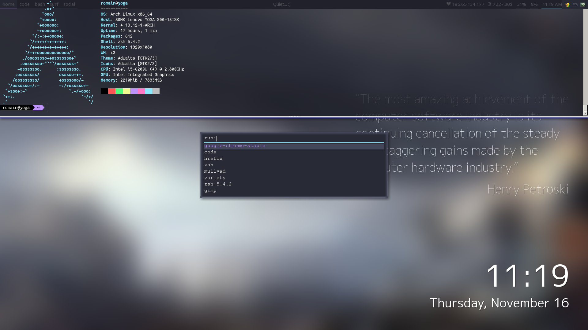
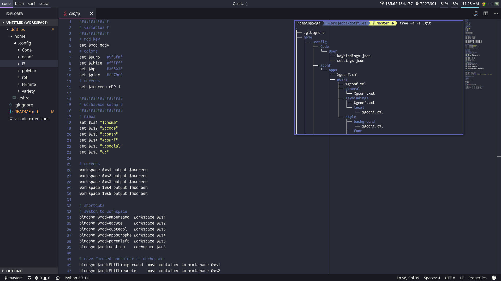
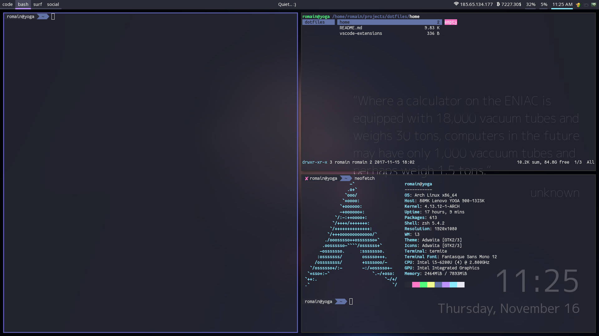

#Table of Contents
- [Screenshots](#screenshots)
- [Pre installation](#pre-installation)
    - [Create live USB](#create-live-usb)
- [Installation](#installation)
    - [Live USB](#live-usb)
        - [Change keymap](#change-keymap)
        - [Setup disks](#setup-disks)
            - [Partition disks](#partition-disks)
            - [Format partitions](#format-partitions)
            - [Mount file systems](#mount-file-systems)
            - [Generate /etc/fstab](#generate-etcfstab)
        - [Install Arch on disk](#install-arch-on-disk)
    - [System setup](#system-setup)
        - [Minor tweaks](#minor-tweaks)
            - [Set timezone](#set-timezone)
            - [Set locale](#set-locale)
            - [Set keymap](#set-keymap)
            - [Set hostname](#set-hostname)
        - [Set root password](#set-root-password)
        - [Install important packages](#install-important-packages)
        - [Setup GRUB](#setup-grub)
            - [[yoga] Add Windows entry](#yoga-add-windows-entry)
        - [Create user](#create-user)
        - [Reboot](#reboot)
- [Setup](#setup)
    - [Network](#network)
        - [Enable NetworkManager](#enable-networkmanager)
        - [Setup WiFi](#setup-wifi)
    - [Yaourt](#yaourt)
    - [Graphical interface](#graphical-interface)
        - [Intall XOrg, Display Manager and Window Manager](#intall-xorg-display-manager-and-window-manager)
        - [Enable lightdm](#enable-lightdm)
        - [Set i3 keymap](#set-i3-keymap)
        - [Set i3 default terminal emulator](#set-i3-default-terminal-emulator)
        - [[yoga] Set resolution at startup](#yoga-set-resolution-at-startup)
    - [[yoga] Touchpad driver](#yoga-touchpad-driver)
    - [Dotfiles](#dotfiles)
        - [Install homesick](#install-homesick)
        - [Recover dotfiles](#recover-dotfiles)
        - [Update dotfiles](#update-dotfiles)
    - [Packages](#packages)
        - [Pacman packages](#pacman-packages)
        - [AUR packages](#aur-packages)
        - [PIP3 packages](#pip3-packages)
- [Other](#other)
    - [VS Code extensions](#vs-code-extensions)
        - [Dump extension list](#dump-extension-list)
        - [Restore extensions](#restore-extensions)
  * [Create live USB](#create-live-usb)
- [Installation](#installation)
  * [Live USB](#live-usb)
    + [Change keymap](#change-keymap)
    + [Setup disks](#setup-disks)
      - [Partition disks](#partition-disks)
      - [Format partitions](#format-partitions)
      - [Mount file systems](#mount-file-systems)
      - [Generate /etc/fstab](#generate-etcfstab)
    + [Install Arch on disk](#install-arch-on-disk)
  * [System setup](#system-setup)
    + [Minor tweaks](#minor-tweaks)
      - [Set timezone](#set-timezone)
      - [Set locale](#set-locale)
      - [Set keymap](#set-keymap)
      - [Set hostname](#set-hostname)
    + [Set root password](#set-root-password)
    + [Install important packages](#install-important-packages)
    + [Setup GRUB](#setup-grub)
      - [[yoga] Add Windows entry](#yoga-add-windows-entry)
    + [Create user](#create-user)
    + [Reboot](#reboot)
- [Setup](#setup)
  * [Network](#network)
    + [Enable NetworkManager](#enable-networkmanager)
    + [Setup WiFi](#setup-wifi)
  * [Yaourt](#yaourt)
  * [Graphical interface](#graphical-interface)
    + [Intall XOrg, Display Manager and Window Manager](#intall-xorg-display-manager-and-window-manager)
    + [Enable lightdm](#enable-lightdm)
    + [Set i3 keymap](#set-i3-keymap)
    + [Set i3 default terminal emulator](#set-i3-default-terminal-emulator)
    + [[yoga] Set resolution at startup](#yoga-set-resolution-at-startup)
  * [[yoga] Touchpad driver](#yoga-touchpad-driver)
  * [Dotfiles](#dotfiles)
    + [Install homesick](#install-homesick)
    + [Recover dotfiles](#recover-dotfiles)
    + [Update dotfiles](#update-dotfiles)
  * [Packages](#packages)
    + [Pacman packages](#pacman-packages)
    + [AUR packages](#aur-packages)
    + [PIP3 packages](#pip3-packages)
- [Other](#other)
  * [VS Code extensions](#vs-code-extensions)
    + [Dump extension list](#dump-extension-list)
    + [Restore extensions](#restore-extensions)
    
# Screenshots






# Pre installation
## Create live USB
```sh
$ dd if=arch-linux.iso of=/dev/sdX bs=4M conv=fsync
```
*Change ISO file name and output device name*

# Installation
## Live USB
### Change keymap
```sh
$ loadkeys be-latin1
```
### Setup disks
| Name      | Format | Size  | Mount  | Note |
|-----------|--------|-------|--------|------|
| /dev/sda1 | FAT32  | 512Mo | /boot  | Only needed for UEFI boot |
| /dev/sda2 | EXT4   | *     | /      | System partition |
| /dev/sda3 | swap   | = RAM | swapon | Swap partition |
#### Partition disks
```sh
$ fdisk /dev/sda
```
#### Format partitions
```sh
$ mkfs.fat -F32 /dev/sda1
$ mkfs.ext4     /dev/sda2
$ mkswap        /dev/sda3
```
#### Mount file systems
```sh
$ swapon /dev/sda3
$ mount  /dev/sda2 /mnt
$ mkdir  /mnt/boot
$ mount  /dev/sda3 /mnt/boot
```
#### Generate /etc/fstab
Automatically mounts filesystems at boot
```sh
$ genfstab -U /mnt >> /mnt/etc/fstab
```

### Install Arch on disk
```sh
$ pacstrap /mnt base base-devel
```

## System setup
Now that Arch is installed, change root to the new system
```sh
$ arch-chroot /mnt
```
### Minor tweaks
#### Set timezone
```sh
$ ln -sf /usr/share/zoneinfo/Europe/Brussels /etc/localtime
$ hwclock --systohc
```
#### Set locale
Uncomment `en_US.UTF-8 UTF-8` and other needed localizations in `/etc/locale.gen`
```sh
$ locale-gen
$ echo "LANG=en_US.UTF-8" >> /etc/locale.conf
```
#### Set keymap
```sh
$ localectl set-keymap --no-convert be-latin1
```
#### Set hostname
```sh
$ echo "myhostname" > /etc/hostname
$ echo "127.0.1.1	myhostname.localdomain	myhostname" >> /etc/hosts
```
### Set root password
```sh
$ passwd
```

### Install important packages
- intel-ucode
- networkmanager
- grub
- efibootmgr

```sh
$ pacman -S intel-ucode networkmanager grub efibootmgr zsh
```

### Setup GRUB
```sh
$ grub-install --efi-directory=/boot /dev/sda
$ grub-mkconfig -o /boot/grub/grub.cfg
```

#### [yoga] Add Windows entry
[Follow this article](https://wiki.archlinux.org/index.php/GRUB#Windows_installed_in_UEFI-GPT_Mode_menu_entry)

### Create user
```sh
$ useradd -m <username>
$ passwd <username>
$ chsh -s /bin/zsh <username>
```
Then add the following line to `/etc/sudoers`
```
<username> ALL=(ALL) ALL
```

### Reboot
```sh
$ exit
$ umount /dev/sda1 /dev/sda2
$ reboot
```
Remove the installation media and boot on the new system

# Setup
## Network
### Enable NetworkManager
```sh
$ systemctl start NetworkManager
$ systemctl enable NetworkManager
```

### Setup WiFi

```sh
$ pacman -S iw wpa_supplicant
$ nmtui
```

## Yaourt
Append the following text to `/etc/pacman.conf`
```ini
[archlinuxfr]
SigLevel = Never
Server = http://repo.archlinux.fr/$arch
```

```sh
$ pacman -Sy yaourt
```

## Graphical interface
### Intall XOrg, Display Manager and Window Manager
- xorg
- lightdm
- lightdm-gtk-greeter
- i3-gaps-next-git
- i3lock-next-git

```sh
$ yes | pacman -S xorg lightdm lightdm-gtk-greeter
# yes | yaourt -S i3-gaps-next-git i3lock-next-git
```
### Enable lightdm
```sh
$ systemctl enable lightdm.service
```
### Set i3 keymap
```sh
$ localectl set-x11-keymap be
```
### Set i3 default terminal emulator 
```sh
$ localectl set-x11-keymap be
```

### [yoga] Set resolution at startup
Create `/usr/share/lightdm.sh`
```sh
# touch /usr/share/lightdm.sh
# chmod a+rx /usr/share/lightdm.sh
```

Containing the following text
```
#!/bin/bash
xrandr --newmode "1920x1080_60.00"  173.00  1920 2048 2248 2576  1080 1083 1088 1120 -hsync +vsync
xrandr --addmode eDP-1 1920x1080_60.00
xrandr --output eDP-1 --mode 1920x1080_60.00
```

Append the following text to `/etc/lightdm/ligthdm.conf` in the **[Seat:*]** section
```
display-setup-script=/usr/share/lightdm.sh
```

## [yoga] Touchpad driver
```sh
$ yes | pacman -S libinput
```

Create file `/etc/x11/xorg.conf.d/30-touchpad.conf` containing
```x11
Section "InputClass"
    Identifier "Synaptics TM3066-082"
    Driver "libinput"
    MatchIsTouchpad "on"
    Option "Tapping" "on"
    Option "TappingButtonMap" "lmr"
EndSection
```

## Dotfiles
### Install homesick
[Homesick](https://github.com/technicalpickles/homesick)
```sh
# yes | yaourt -S homesick
```
### Recover dotfiles
```sh
# homesick clone phito/dotfiles
# homesick link dotfiles
```
### Update dotfiles
```sh
# homesick pull dotfiles
```

## Packages
### Pacman packages
| Name               | Notes                                      |
| ------------------ | ------------------------------------------ |
| firefox                 | Web browser                                |
| git                | Version Control System                     |
| termite            | Terminal emulator                          |
| guake              | Terminal emulator (F12)                    |
| compton            | X11 compositor                             |
| rofi               | Application launcher                       |
| redshift           | Adjusts the computer display's color temperature based upon the time of day |
| variety            | Wallpaper manager                          |
| scrot              | Screenshot manager                         |
| feh                | X11 image viewer (for wallpaper)           |
| xclip              | cli cliboard manager                       |
| openssh            |                                            |
| mplayer            | Video player, mostly for codecs            |
| ranger             | File manager (cli)                         |
| dotnet-runtime-2.0 | DotNet Core runtime                        |
| python-pip         | Python package manager                     |
| jdk-8-openjdk      | Java jdk                                   |
| maven              | Java build system                          |
| mariadb            | SQL database system                        |
| xf86-input-synaptics | Touchpad driver                          |

```sh
$ yes | pacman -S firefox termite compton rofi guake redshift variety scrot feh xclip openssh mplayer ranger dotnet-runtime-2.0 python-pip jdk-8-openjdk maven mariadb xf86-input-synaptics
```

### AUR packages
| Name                    | Notes                                      |
| ----------------------- | ------------------------------------------ |
| polybar                 | i3 status bar                              |
| homesick                | Dotfile manager                            |
| ttf-mplus               | Font                                       |
| ttf-font-awesome        | Font                                       |
| otf-fantasque-sans-mono | Font                                       |
| i3lock-color            | Screen locker (required for i3lock-next)   |
| i3lock-next-git         | Screen locker                              |
| visual-studio-code      | IDE                                        |
| icu55                   | International Components for Unicode library (required to debug C#) |
| neofetch                | System informations (cli)                  |
| dotnet-sdk-2.0          | DotNet Core sdk                            |
| mullvad                 | VPN client                                 |
| oh-my-zsh               | zsh config manager                         |

```sh
# yes | pacaur -S polybar homesick ttf-mplus ttf-font-awesome ttf-fantasque-sans-mono i3lock-color i3lock-next-git visual-studio-code icu55 neofetch dotnet-sdk-2.0 mullvad oh-my-zsh
``` 

### PIP3 packages
| Name                    | Notes                                      |
| ----------------------- | ------------------------------------------ |
| requests                |                                            |

```sh
$ pip3 install requests
``` 

# Other
## VS Code extensions
### Dump extension list
```sh
# code --list-extensions > vscode-extensions
```
### Restore extensions
```sh
# while read in; do code --install-extension $in; done <vscode-extensions
```
